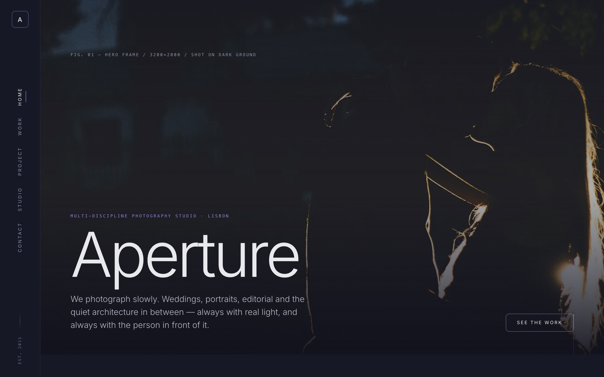
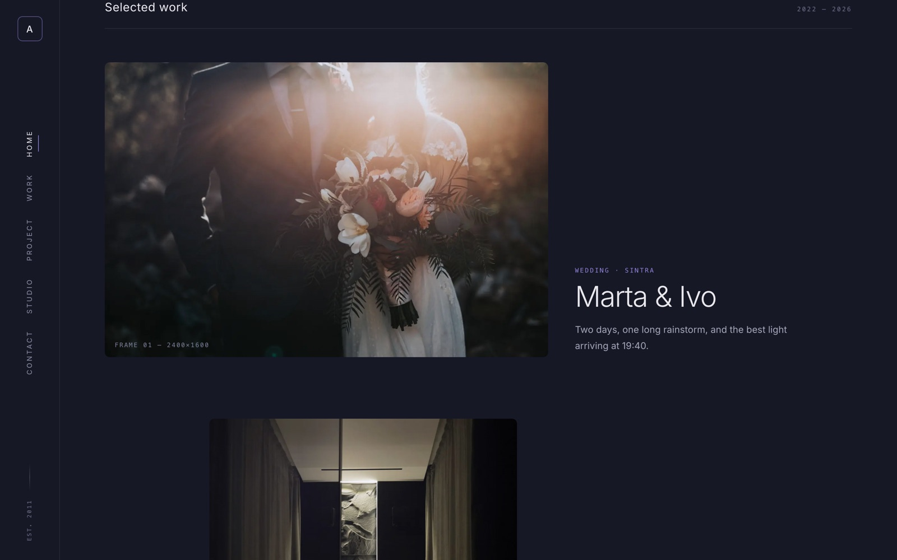
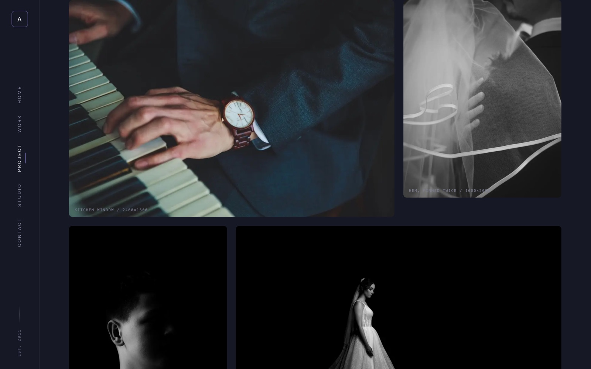

<div align="center">

# Aperture

**A photography-studio website template — part of the [Templify](https://github.com/manusmd) collection.**

Dark, editorial, and cinematic. Built with Next.js 16 and Lenis.



</div>

---

## Highlights

- 🎞️ **Five views** — Home, Work, a project Story, Studio, Contact — with a signature **page-wipe transition**
- 🧭 **Vertical side-nav** (desktop) / top bar + overlay (mobile), with an active-item mark
- 🖼️ **Lightbox gallery** — keyboard driven (← → / Esc), on the project story
- ✨ **Cursor-following work preview**, parallax, reveal-on-scroll, animated scroll cue
- 🩶 **Editorial dark design** — Inter + monospace labels, indigo/violet accent
- ♿ **Resilient** — fully **no-JS and reduced-motion safe** (content is never hidden behind an animation)
- 🧩 **Content-driven** — the whole site renders from one typed file, `lib/content.ts`
- 🌀 **Lenis smooth scroll** + a matching custom scrollbar
- 🖼️ **`next/image`** throughout (example photography from Unsplash)
- ⚡ **Static** — deploys to Vercel with zero configuration

## A closer look

| Selected work | Project story |
| --- | --- |
|  |  |

## Getting started

```bash
npm install
npm run dev
```

Open [http://localhost:3000](http://localhost:3000).

## Editing content

Everything the site shows lives in one typed object: **`lib/content.ts`** — studio
name, hero, work projects, the project story + gallery, studio, and contact.
Change it and the site updates. Swap the Unsplash image IDs for your own frames.

## Deploy

Push to GitHub and import on [Vercel](https://vercel.com/new) — it's a static
Next.js site, nothing to configure.

## Structure

```
lib/content.ts            Site content (typed, single source of truth)
app/App.tsx               View state, page-wipe, lightbox, Lenis + parallax loop
app/components/           Nav, Views (Home/Work/Story/Studio/Contact), Img
```

## Tech

Next.js 16 · React 19 · TypeScript · Lenis · next/font · next/image

---

<div align="center">
<sub>A Templify template. Example photography via <a href="https://unsplash.com">Unsplash</a>.</sub>
</div>
